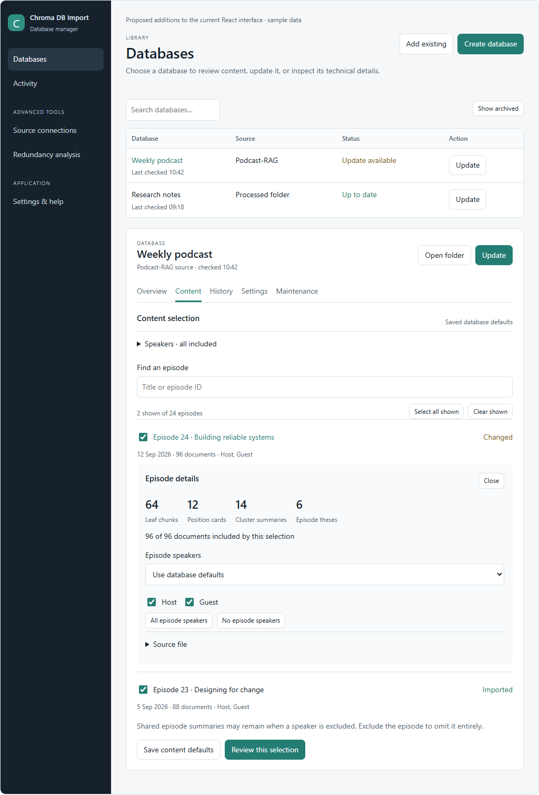
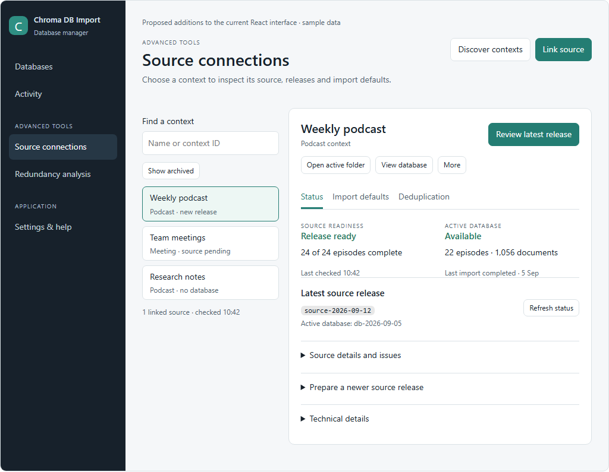
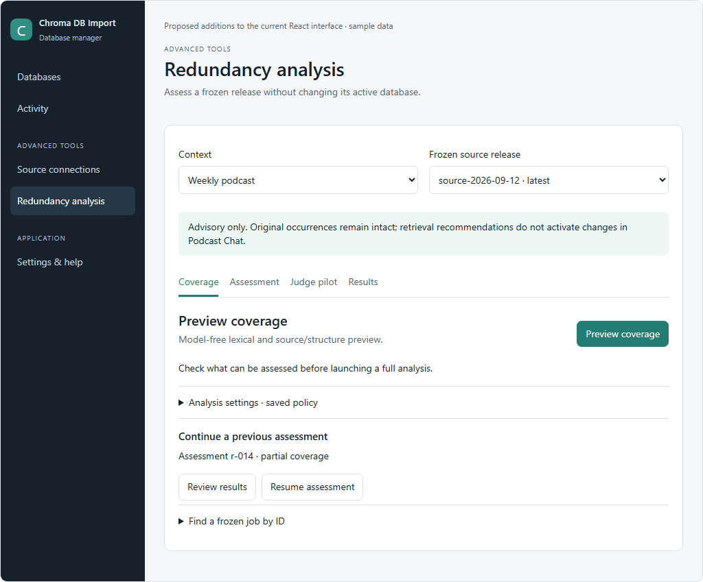

# React UI completion specification

Version 1.0 · 2026-09-12 · Approved visual direction; implementation pending

## 1. Authority, purpose and scope

Extend the **existing React database manager** to cover the usable legacy Qt
capabilities identified in the [75-item audit](gui-react-parity-audit-and-design.md).
This is the normative UI specification. The companion
[implementation guide](gui-react-ui-implementation.md) specifies how to build it.
The audit records evidence; it is not the implementation checklist. The older
`gui-simple-workspace-design.md` is superseded. The original root GUI documents
describe the first React build and must not be used to restart that completed work.

The user approved the rendered direction and explicitly requested **C: only**.
All source, documentation, test fixtures and review assets stay in
`C:\temp\codex\Chroma DB Import`. No propagation to D: is authorized.

MUST means required for this feature-completion release. MAY means optional and
must not delay required functionality. Screenshots show layout and hierarchy;
their sample values and simulated button behavior are not application contracts.
When a screenshot differs from this text, this text controls.

### Included

Complete Source connections and Redundancy analysis in their existing locations;
add inspection, bulk speaker selection, archived-item restoration, scoped defaults,
settings transfer, Guide and reviewed GPU repair; preserve the existing create,
register, update, history, activity and maintenance workflows.

### Explicitly excluded

New rendering framework, navigation redesign, literal Qt toolbar, cloud service,
raw-audio processing, in-app producer Resume, arbitrary model/profile selection,
editable contextualization, editable existing database identity, release promotion/
rollback/prune, automatic deletion and automatic settings migration. Effective
contextualization and pinned identity are displayed read-only. Deep dedup group/pair
browsing MAY follow the required validated aggregate reports.

GPU installation is in scope as a reviewed workflow, not an automatic operation.
The command-copy fallback remains usable during implementation, but alone does not
complete that task. Live GPU acceptance may be explicitly unavailable on the test
machine; that must be reported separately from code/test completion.

## 2. Interaction priorities

Use Huffman-inspired effort allocation: common actions have short, visible paths;
occasional settings are reachable through labeled sections. Do not literally build
a binary menu tree. Frequency is an operator hypothesis, not measured telemetry.

| Task and starting point | Required shortest normal path |
| --- | --- |
| Update a configured database from its visible row | Update → Apply update |
| Open the selected database's export | Open folder |
| Inspect an episode from Content | Episode title |
| Include all speakers from open speaker selector | All speakers; then save or review the draft |
| Import an available release from selected context | Review latest release → Apply update |
| Prepare ready processed content from selected context | Prepare update → review → Apply update |
| Preview analysis from a selected analyzable release | Preview coverage |
| Restore from an archived list | Restore |

Counts exclude typing, native pickers, computation time and issue-specific
acknowledgments. No-change reviews have no Apply action. There is no extra generic
“Are you sure?” after a complete ordinary update review. Deletion and installation
retain their own explicit review. Keep navigation order stable; remember context
instead of asking for the same root, partition, release or destination repeatedly.

## 3. Visual shell and navigation

Preserve the existing `frontend/src/styles.css` design language:

* Dark sidebar (`#17212b`), muted light page (`#f5f7f9`), white cards, teal primary
  actions (`#247d73`), existing typography, rounded controls and quiet borders.
* Reuse current classes/components where possible. Do not import prototype CSS
  wholesale, add a component framework, or alter the application's theme system.
* Preserve the current desktop sidebar width and main padding at normal desktop
  sizes. At 960px reduce main padding so fields remain usable. Current native
  minimum size is 960×640; this release does not need to change it.
* Tables may scroll horizontally when genuinely necessary. Inputs and action rows
  wrap; no clipped primary buttons. Long paths wrap or truncate with a visible Copy
  action. In narrower browser tests, stack two-column panels rather than shrinking text.
* One primary action per task group. Secondary actions use current outline buttons.
  Never make Archive the direct action of a button labeled only with an ellipsis.

Navigation, unchanged:

```text
Databases
Activity [running count]

ADVANCED TOOLS
Source connections
Redundancy analysis

Settings & help
```

Database tabs, unchanged: **Overview · Content · History · Settings · Maintenance**.
Source local tabs: **Status · Import defaults · Deduplication**.
Redundancy local tabs: **Coverage · Assessment · Judge pilot · Results**.
Local tabs are freely navigable views, not obligatory wizard steps.

Cross-links MUST carry database/context/release identity explicitly. **View source**
opens that database's context, **View database** opens its matching registered
database, and **Analyze redundancy** preselects that context and an analyzable
release. A stale selection elsewhere in the application must not change the target.
If several databases match, display their names/targets and require selection; do
not choose arbitrarily. If none is registered but a valid export exists, offer
**Add existing** prefilled with that export.

## 4. Shared state and data rules

### 4.1 Names, identity and status

Show display names first. Keep app database ID, partition ID, corpus ID, source
release ID, downstream release ID and assessment job ID distinct. Never join
objects by display name. A managed context can exist with no database and several
release versions. Archive status is local visibility, not database validity.

Unknown data is **Not checked**, **Not available** or an em dash with explanatory
text; never default unknown counts to zero. Every cached check has a timestamp.
Source readiness and active database health have independent labels and timestamps.
Publishing a source release does not activate a database.

### 4.2 Drafts and persistence

Keep existing automatic Create-draft persistence. Selection and settings edits are
drafts until their named Save/Review action. Preserve drafts during navigation;
restore them by immutable scope ID, not one global form. Show **Unsaved changes**
and **Saved** state. A late request for context A must never populate context B.

Save increments the relevant settings revision; read-only inspection does not.
Review binds source snapshot, target identity, effective selection/profile and
execution settings. Changes invalidate the applicable review. Present **Prepare a
fresh review** on stale state. A new latest release does not change a frozen review's
selected release; inspect/revalidate its own snapshot and show newer availability.

Do not make input values look saved merely because a request was sent. On failure,
retain the draft and show the error. Store no operational defaults solely in
browser localStorage; the Python catalog is authoritative.

### 4.3 Reports

Use one Report view for validation, collection details, import preview, source
inspection, dedup and redundancy outcomes. It has:

1. Title, result status, scope/release, generated timestamp.
2. Relevant labeled counts only; no universal fabricated metrics grid.
3. Findings with severity, affected file/record and suggested action.
4. Expandable Technical details, identifiers and raw JSON.
5. **Copy report**, **Save report**, and Back/Close preserving originating state.

Report status is pass / warnings / partial / failed / unavailable. Report files are
durable; a native Save dialog exports a chosen copy. Canceling Save is not failure.
No inline report action mutates a database. An import preview with writes uses the
existing reviewed Apply flow; a standalone inspection has no Apply button.

### 4.4 Jobs and errors

Reuse the persistent job strip and Activity. Long operations return a job promptly,
poll while queued/running, and remain accessible after navigation/restart. Disable
duplicate launches. Show queued / running / cancelling / completed / completed with
warnings / failed / interrupted / cancelled based on backend facts. Cancelling may
be a stage of running until the backend acknowledges it.

Only show Cancel when supported. Retry reruns a supported failed operation; Resume
continues a frozen redundancy assessment. They are not interchangeable. Display
bundle preservation and partial coverage explicitly. Errors show scope, what failed,
what remains usable and a specific recovery action; active database state comes
from the backend, never an optimistic UI assumption.

## 5. Databases page



### 5.1 Library and header

Keep search, **Add existing**, **Create database**, table and selected detail card.
Add **Active / Archived** filter, default Active, remembered per session. Search
filters within the chosen view. Empty states distinguish no databases from no
search matches. No-result searches must not imply the library is empty.

Keep row **Update**. Add a real **More** menu containing **Archive database** and
any existing contextual operations. Archive means “Hide this library entry; keep
database files.” Show a completion message with Undo/Restore. Archived rows offer
**Restore**; restoring does not import, recreate files or change the active pointer.
Do not place routine Update on archived rows.

Selected detail header: database name/source, **Open folder**, **Update**. Opening
validates the registered target or managed active export. A missing/invalid active
pointer must not silently open an old release or create an empty folder. Show a
specific error and View source/History action.

### 5.2 Overview

Keep existing identity/settings summary; add active episode/document counts and
**View source** for managed records. **Database details** disclosure contains:

| Field | Required handling |
| --- | --- |
| Database ID and resolved collection | Actual downstream metadata, not a guessed display-name slug |
| Export path | Verified active path; Copy path |
| Manifest/importer version | Present value or missing/invalid status |
| Model, revision, dimensions, representation identity | Pinned recorded values; read-only |
| Source file and episode counts | Distinguish stored metadata from current source inventory |
| Metadata validity | Validator result and checked timestamp; not inferred from file existence |
| Managed release IDs/profile fingerprint | Separate upstream/downstream labels |

Provide Copy details / Save report. Invalid metadata remains inspectable with an
error report; it must not be shown as an empty healthy collection.

### 5.3 Content

Content reads both source inventory and stored metadata when available. Stored-only
episodes remain visible and marked **Missing from source · retained**. If source is
unavailable, show stored inventory with unavailable source-derived metrics; do not
disable all inspection or manufacture source counts.

Order: Content selection heading/scope → collapsed **Speakers** summary → episode
search → shown/total counts and bulk episode controls → episode rows → shared-context
explanation → **Save content defaults** and **Review this selection**.

Each episode row contains a separate inclusion checkbox, clickable title, date,
source document count, speakers and last-comparison state. Clicking title opens an
inline detail panel without toggling inclusion. States: New / Changed / Imported /
Not checked / Missing from source. State derives from source and stored fingerprints
using the registered target, with checked-at information. New does not mean written.

Episode details: title/date, source file with Copy, total source documents,
included-by-draft count, leaf chunks, position cards, cluster summaries and episode
theses. Counts unavailable from real metadata read **Not available**. Closing details
restores focus to the episode title. Keep search, selection and scroll position.

#### Exact speaker selection behavior

The Python selection resolver remains authoritative. Reuse one selection editor in
Create, Content and one-run Update; do not implement three differing rule systems.

| Control | Behavior |
| --- | --- |
| Speaker policy | All speakers except exclusions (includes future new speakers) or Only selected speakers (allowlist) |
| Global speaker checkbox | Checked if included in every eligible episode containing that speaker; mixed if some; unchecked if none; excluded episodes are not silently re-enabled |
| Clicking a mixed global speaker | Includes that speaker in every applicable episode; changing a global speaker reconciles only that speaker in existing overrides |
| All speakers | `all` with empty exclusions and remove per-episode speaker overrides; preserve episode exclusions. Helper text says this resets speaker exceptions |
| No speakers | Empty allowlist and clear speaker overrides; preserve episode exclusions. Do not convert it into all speakers |
| Episode mode | Use database defaults removes the override key; Custom speakers creates an explicit array, which may be empty |
| All/No episode speakers | Affects only that episode's override; never changes another episode or the global policy |
| Select all shown / Clear shown episodes | Acts only on the full filtered result set, including its pages; label the affected count. No hidden search matches outside this set are changed |

Speaker search, if added, only changes visibility; All speakers still has global
scope. Do not label filtered speaker actions “All speakers.” An episode exclusion
removes the episode entirely. Speaker omission can leave shared/unattributed
documents. In particular, current `include_document` retains documents with no
speaker metadata even with an empty speaker selection. Do not replace that behavior
with a count shortcut. Included-document counts must be computed by the backend.

Changing selections recalculates prospective counts with stale-response protection.
**Save content defaults** saves policy only. **Review this selection** creates an
exact one-run preview without saving database defaults. It must work for folder and
managed sources; the latter requires backend selection support before UI completion.

### 5.4 History, Settings and Maintenance

History keeps jobs and active/source release details. Promotion/rollback/prune
remain clearly documented external workflows. Show warning/partial outcomes and
links to durable reports; selecting a historical row never promotes it.

Settings keeps display name, source and asset filter. Add expandable **Import
settings** with Auto/CPU/available CUDA devices, current resolved device and pinned
representation details. Display contextualization read-only. Save device as an
execution option; changing it does not change embedding identity but invalidates a
preview whose planned execution options no longer match. Show unavailable saved
CUDA choices with a repair/change-device action; never silently replace an explicitly
chosen GPU. Auto may fall back and must disclose the resolved device/reason.

Maintenance leads with **Validate** and **Preview import**. Remember source/database/
both validation scope; default Both when both exist. Starting from a selected
database should not require another target picker. Full validation includes per-file
issues and database/manifest validity. Preview includes eligibility, invalid/source
counts, reconciliation, embedding readiness/identity, staging, dates, errors/warnings.

Retain **Review rebuild** and **Review outdated records** below the read-only tools.
Folder rebuild is staged. Record deletion requires exact IDs and reasons. Managed
rebuild/removal limitations stay enforced; direct the user to producer release
preparation without manufacturing support or bypassing retention protection.

## 6. Create and Add existing

Retain **Content → Location → Review** and existing collision handling.

Content supports Processed files folder and Podcast-RAG source. Managed source
selection uses the discovered context browser data; a contextual Create preselects
the connection/partition. Never ask for IDs already known. No prepared release means
View source/Prepare release, not an empty ready-to-create screen.

Folder input offers validated recent/suggested folders and Browse. Selecting a
folder starts a scan, while **Inspect folder** expands a local inspector rather
than adding a mandatory fourth step. Inspector: lazily expanded folder tree,
matching/excluded/invalid counts, up to 12 sample filenames, date range with provenance
(metadata or filename estimate), and exclusion reasons. **Use folder** confirms the
inspector's candidate into the draft; Cancel preserves the prior folder. A simple
Browse selection may update the draft directly and scan, as it does today.

Asset options are Reviewed / Cleaned / Raw / All processed assets / Custom pattern.
Custom reveals a required pattern field. Reuse Python matching semantics. A pattern
or source change clears obsolete scan results and invalidates review. Zero matching
assets offers Change filter; zero eligible records prevents Create. Never enable
Create solely because unrelated cache files exist.

Location uses saved application output parent as a suggestion, with exact resolved
target visible. Display name never determines future relocation. Technical identity
is generated/read-only. Existing target offers Use existing or Choose another
location, not overwrite. Explicit one-run input overrides suggested defaults.

Review runs validation and shows real source, selection, destination, representation,
device and effects. **Create database** launches the reviewed job. Add existing stays
read-only inspection followed by registration, preserving on-disk identity and paths.

## 7. Source connections



### 7.1 Browser and linking

Header: **Discover contexts**, **Link source**. Left: search, Active/Archived view,
context rows with name/type/status and linked-source summary. Right: selected
context detail. The first valid row may be selected on initial entry; explicit deep
links take precedence. Contexts without databases MUST appear.

Link source: native root picker, selected root, **Link and discover**, Cancel. Link
persists a normalized source connection and runs discovery. Discovery changes only
importer-owned connection/catalog visibility; it neither processes content nor
imports/activates exports. Show discovered context/release counts and rejected
candidates with reason/path. Repeating the same link is idempotent.

Context identity is manifest-defined. Duplicate IDs across conflicting roots yield
an explicit conflict; do not overwrite another connection. Existing registered
catalog references are preserved, not silently relocated. New links use importer-
owned catalog state. Producer roots remain read-only except an explicitly requested
Prepare release operation supported by the producer adapter.

### 7.2 Header and next action

Header shows selected name/type, primary next action, **Open active folder**, **View
database**, and real More menu. Hide unavailable Open active folder/View database;
show Create or Add existing as appropriate. More contains Archive context,
Connection details and Analyze redundancy. Archive/Restore are independent of
database-entry archive. Archive never deletes files, releases or database entries.

Next action priority, evaluated by backend-derived capabilities:

| Condition | Primary action |
| --- | --- |
| Operation already running for this scope | View activity |
| Invalid/disconnected source or invalid target identity | Review source issues / Repair registration, as appropriate |
| Valid persisted preview | Continue review |
| No database; prepared importable release | Create database, prefilled |
| Valid newer importable release | Review latest release |
| No ready release; processing complete and publication supported | Prepare update |
| No ready release; pending/failed/interrupted producer work | Review source issues |
| State not yet checked, or current with no newer work | Refresh status |

A ready release can coexist with later pending source work. Review that ready
release remains available. Differentiate “latest discovered” from “latest valid
importable”; show rejected/newer candidates in issues. Never silently choose an
older release while labeling it the latest discovered release.

### 7.3 Status tab

Source readiness and active database health are two separate sections. Show
completed/declared source episodes, latest ready source release, checked timestamp;
active downstream release, stored episode/document counts and last import outcome.

Source details: pending, failed, interrupted, quarantined, processed cache count,
latest handoff, producer latest release and warnings. Release details: discovered
release count, latest status, quarantined/failed releases, active pointer condition.
Technical details: partition, corpus, workflow, linked root, database root, saved
profile fingerprint and portable-metadata explanation. Provide Copy details.

**Refresh status** reads readiness only. **Prepare update** explicitly publishes
processed content, discovers the returned release, and creates a preview pinned to
that release; it never imports until Apply update. If preparation succeeds but
review fails, report “Release prepared; import review failed” with the release ID and
Retry review. Do not publish again to recover the preview.

Producer recovery copy: “Complete or resume processing in the producer application,
publish its release, then refresh this context.” No in-app producer Resume button.

### 7.4 Import defaults tab

Show scope, saved/unsaved state, pinned representation, device, speaker policy and
**Save import defaults**. Profile fingerprint and effective contextualization are
read-only technical details. Source profile and execution-device options have
separate persistence semantics; saving device must not silently generate a new
representation or change its release identity.

Managed speaker rules use the same explicit all/allowlist/empty/episode policy as
Content. Saved defaults affect subsequent previews/imports. Existing legacy
`selected_speakers=[]` semantics are preserved until a versioned modern policy is
explicitly saved; never reinterpret old catalogs globally. Context changes never
inherit speakers from an unrelated folder currently open in the GUI.

### 7.5 Deduplication tab

Show current profile Off/Safe/Audit, saved revision and backend-generated summary.
Offer **Report near repetitions** and **Collapse exact repetitions during retrieval**.
Advanced matching contains near Jaccard threshold, near length ratio and maximum
near-match block records. Validate numeric ranges with the existing policy resolver;
render its error next to the relevant field. Do not invent ranges or policy behavior.

**Save defaults** persists validated profile changes only. **Preview next import**
uses the last saved profile. With unsaved edits, present **Save and preview** and
**Discard edits and preview saved defaults**; do not silently preview old values.

Preview is model-free, with no embeddings/activation or saved-policy changes except
the explicit Save above. Show eligible/stored/suppressed-exact/would-suppress counts,
exact groups, plan fingerprint and saved policy identity. **Review active release**
validates existing artifacts and shows stored/suppressed/would-suppress counts, exact
groups, near edges and coverage. No active export gives an informative empty state.

Explain Safe/Audit downstream alias compatibility. The importer does not claim a
consumer supports a contract without evidence. **Analyze semantic redundancy** links
to that separate advisory workflow; dedup settings never auto-enable a judge.

## 8. Redundancy analysis



### 8.1 Scope and release eligibility

Keep context and frozen release selectors visible across local tabs. Display source
release ID and resolved analysis export identity separately. The CLI requires a
readable analysis export; discovery of a release manifest alone is insufficient.
Only analyzable releases can launch operations. Other releases show “Import required
before analysis” or the backend's concrete reason and the appropriate source/update
link. Default to the latest analyzable release, visibly labeled, not blindly newest.

Scope changes preserve completed old results under their original identity, clear
scope-specific transient forms, and never relabel an old bundle. If an unsaved
settings draft exists, retain it under its own scope and indicate it on return.
All actions are advisory; no activation, retrieval adoption or deletion button.

### 8.2 Coverage and saved analysis settings

**Preview coverage** computes model-free lexical/source coverage without an assessment
bundle. A durable UI report/job is allowed; it must not be presented as a frozen
assessment job. Display the report's actual scope and metrics, not invented dense
coverage. Saved Analysis settings disclosure: vector storage Full/Shared input and
retrieval recommendation Ranked/Semantic MMR, **Save policy**, revision/fingerprint.

Also show the most recent resumable assessment: status, release, **Review results**,
**Resume assessment**. **Find a frozen job by ID** supports externally started jobs.

### 8.3 Assessment

Lexical / Source and structure / Dense checkboxes are **This run's channels**.
Initialize from saved/default policy, but do not imply changing a checkbox saved the
policy. At least one is required. Show readiness per channel; unavailable requested
coverage is a finding, not silently deselected. **Run assessment** never invokes
the judge, even when saved judge permission is on. Freeze selected channels and policy.

Run returns a durable UI job linked to the frozen assessment ID. Disable duplicate
submission. Partial coverage preserves the bundle and shows **Partial coverage**,
requested/completed/pending channels, reasons and supported Resume. A failed run
does not automatically mean a valid bundle exists.

### 8.4 Judge pilot

Judge is optional and initially off. Controls:

| Field/action | Requirement |
| --- | --- |
| Allow an explicit judge pilot | Saved permission only; never launch on toggle/save |
| Candidate fraction / maximum calls | Validated by backend policy; show fraction, cap and derived bound when available |
| Save judge policy | Save scoped validated policy revision |
| LM Studio URL | Supported local endpoint; validate with existing judge rules |
| Model ID | Required explicit installed model ID; empty initially; no placeholder text submitted as value |
| Model fingerprint | Optional immutable artifact identity |
| Save judge configuration | Independent scoped save; no model request |
| Review pilot | Check saved opt-in, connection/model, channels and workload bound |
| Run pilot | Final explicit execution after review; bound to reviewed fingerprints |

No automatic model selection/download. Saved permission is not permission to judge
ordinary assessments. Changes after pilot review require a new review. Show timeout,
endpoint/model failures and unjudged coverage. Never retry judge calls via a generic
new-job button if a frozen Resume is the supported operation.

### 8.5 Results, resume and evaluation

Results defaults to a selected/current-context bundle. **Open bundle** uses a native
directory picker; validate schema, checksums and scope before showing validated
status. A valid different-scope bundle offers View on its own scope. Invalid files
remain an error report, not empty successful results.

Minimum report: bundle ID/path, source/export/policy identity, channels and judge
coverage, status, warnings, aggregate counts, raw details, Copy/Save report. Deep
pair/evidence browsing is optional; never present evidence without provenance.

Resume resolves a frozen job by ID, verifies compatible scope/configuration and uses
that job's frozen payload. It must not pick up today's edited channels/model. Cancel
uses cooperative cancellation and waits for acknowledgment; a preserved partial
bundle may remain available.

Export label examples uses selected validated bundle, then native destination picker.
Evaluate requires that bundle and reviewed labels, optional queries/results, and
output destination in one form. Validate inputs together; a mismatched label/query
scope cannot be force-applied. **Evaluate labels** starts a job, then shows its
saved report. Picking/canceling optional files does not launch evaluation.

## 9. Settings & help

Keep Environment and Legacy-state migration. Add New database defaults, Settings
transfer and Guide as clearly labeled sections.

**New database defaults:** output parent, asset filter/custom pattern, device.
Pinned representation/effective contextualization are read-only. Defaults are
suggestions for future creation; never retroactively rewrite existing database
settings or destinations. Precedence: explicit draft override → saved database/
context option → app creation default → supported backend default. Display origin
where it helps distinguish a saved value from a suggestion.

**Environment:** Python environment identity, CPU/CUDA readiness and available device
names; Run diagnosis, Copy diagnostics and Repair GPU support. Repair opens a review
of exact executable/environment, package action, download impact and supported
command. **Install** launches only that reviewed action. Keep progress/error/report,
then rerun diagnosis. Successful process exit is not proof of usable CUDA; show
“Installation completed; CUDA still unavailable” when appropriate. Do not request
elevation automatically or accept arbitrary commands from the renderer.

**Settings transfer:** choose one scope per transfer: application defaults, selected
database settings/selection, or selected managed context profile/options. Optional
non-secret redundancy configuration belongs to the selected context scope. Export
states what is included and excludes database content, active pointers, job history,
secrets and unrelated operational settings.

Import reads/validates a versioned JSON file, then shows a field table with current
value, proposed value, compatibility and inclusion checkbox. Scope/target must be
explicitly selected. Compatible fields start selected; immutable/incompatible fields
are unselectable with reasons. **Apply selected settings** commits one scoped,
validated merge. Omitted fields remain unchanged. No full-file replacement or
partial multi-field success hidden behind “Saved.” Preview becomes stale when the
file or target settings change. Report applied/skipped fields.

Legacy settings map only fields actually present and compatible. Fingerprint-keyed
episode selections require verified mapping to current episode identities. Ambiguous
or unmatched episodes are listed and not guessed. Identity mismatch blocks incompatible
application and can offer Create separate database; it never edits vector identity.

**Guide:** local, searchable task articles: Create, Add existing, Update, Selection,
Managed sources, Deduplication, Redundancy, Settings transfer, GPU repair, Recovery.
Contextual Help opens the relevant article and returns to the preserved draft.
Do not copy Qt's stale instructions about deleting/rebuilding or model editability.

## 10. Accessibility and acceptance

Native labeled controls; meaningful keyboard focus; Escape/Back for menus/dialogs;
focus returns to trigger. Tabs implement keyboard selection and ARIA relationships.
Tri-state checkboxes expose mixed state. Async changes are announced without moving
focus. Findings link to fields. Essential controls do not require hover. Color is
always accompanied by text. Labels remain readable at normal scaling and 200% zoom.

Required acceptance journeys and detailed task tests are in the implementation guide.
Completion requires real bridge/backend behavior with synthetic fixtures, not the
approved screenshots or a mock-only UI. Every audit ID must map to implemented,
preserved, intentionally replaced or explicitly excluded behavior. No unresolved
required task may be reported as complete because its button is visible.
